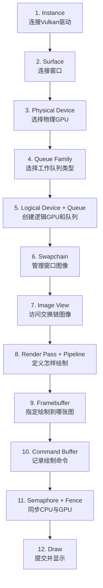

# Vulkan 资源依赖速查表（简化版）

## 只记这一条主线



## 简明依赖表

| 阶段 | 资源 | 依赖 | 一句话理解 |
| ---: | --- | --- | --- |
| 1 | Instance | Vulkan Loader | Vulkan程序总入口 |
| 2 | Surface | Instance + 窗口 | 把Vulkan接到窗口 |
| 3 | Physical Device | Instance | 选择真实GPU |
| 4 | Queue Family | GPU + Surface | 找能绘图和显示的队列族 |
| 5 | Device + Queue | GPU + Queue Family | 创建逻辑GPU；Queue同时创建 |
| 6 | Swapchain | Device + Surface | 管理轮流显示的窗口图像 |
| 7 | Image View | Swapchain Image | 让程序能够访问图像 |
| 8 | Render Pass + Pipeline | Device + Shader | 规定如何绘制 |
| 9 | Framebuffer | Render Pass + Image View | 规定绘制到哪张图 |
| 10 | Command Buffer | Command Pool | 记录GPU命令 |
| 11 | Semaphore + Fence | Device | 控制CPU和GPU执行顺序 |

## 队列重点

```text
vkCreateDevice()   → 创建Device时同时请求Queue
vkGetDeviceQueue() → 只是取得Queue句柄，不是再次创建
```

## 每帧流程

```text
等待上一帧 → 取得交换链图像 → 提交绘制命令 → 显示图像
```

## 销毁原则

```text
先 vkDeviceWaitIdle()，再按照创建顺序反向销毁。
```

不需要单独销毁：`VkPhysicalDevice`、`VkQueue`、Swapchain Image，以及随Command Pool释放的Command Buffer。
