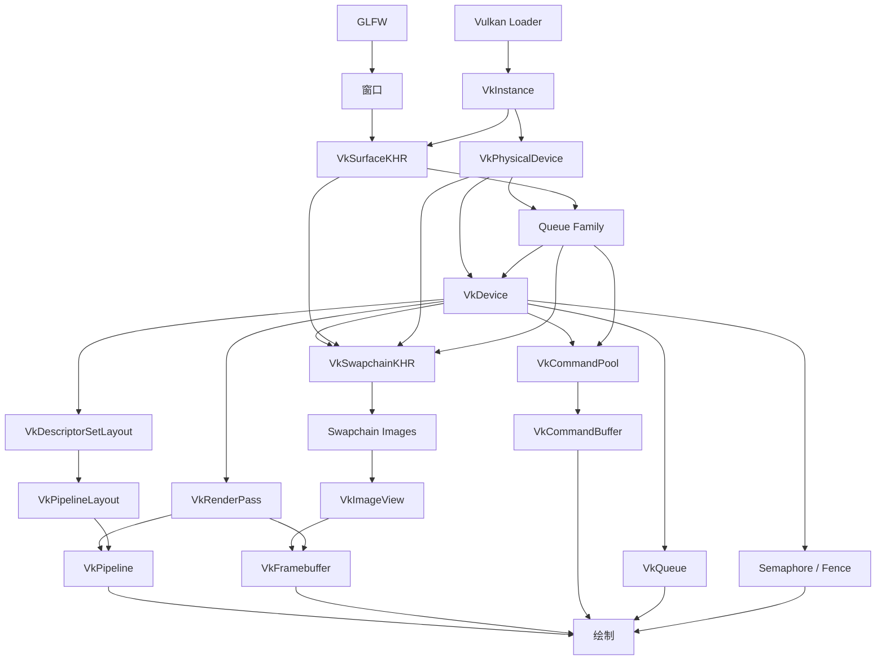

# Vulkan 资源依赖图表（完整版）

> 原则：先创建被依赖的资源，销毁时通常反向进行。

## 总体依赖图



## 完整依赖表

| 顺序 | 资源 | 创建时依赖 | 作用 | 销毁方式 |
| ---: | --- | --- | --- | --- |
| 1 | GLFW窗口 | GLFW | 显示最终画面 | `glfwDestroyWindow()` |
| 2 | `VkInstance` | Vulkan Loader、实例扩展 | Vulkan程序入口 | `vkDestroyInstance()` |
| 3 | `VkSurfaceKHR` | Instance、窗口 | 连接Vulkan和窗口 | `vkDestroySurfaceKHR()` |
| 4 | `VkPhysicalDevice` | Instance | 表示物理GPU | 不需要销毁 |
| 5 | Queue Family | Physical Device、Surface | 寻找图形和呈现队列 | 不需要销毁 |
| 6 | `VkDevice` | Physical Device、Queue Family | 应用使用的逻辑GPU | `vkDestroyDevice()` |
| 7 | `VkQueue` | 创建Device时请求 | 向GPU提交工作 | 不需要销毁 |
| 8 | `VkSwapchainKHR` | Device、Surface、GPU支持信息 | 管理窗口图像 | `vkDestroySwapchainKHR()` |
| 9 | Swapchain Image | Swapchain | 保存待显示画面 | 不需要销毁 |
| 10 | `VkImageView` | Device、Image | 定义图像访问方式 | `vkDestroyImageView()` |
| 11 | `VkRenderPass` | Device、附件格式 | 定义渲染流程 | `vkDestroyRenderPass()` |
| 12 | `VkDescriptorSetLayout` | Device、Shader资源 | 定义Shader资源布局 | `vkDestroyDescriptorSetLayout()` |
| 13 | `VkPipelineLayout` | Device、Descriptor布局 | 连接管线与Shader资源 | `vkDestroyPipelineLayout()` |
| 14 | `VkPipeline` | Shader、Pipeline Layout、Render Pass | 保存绘制配置 | `vkDestroyPipeline()` |
| 15 | `VkFramebuffer` | Render Pass、Image View | 绑定渲染流程和图像 | `vkDestroyFramebuffer()` |
| 16 | `VkCommandPool` | Device、Queue Family | 管理命令缓冲 | `vkDestroyCommandPool()` |
| 17 | `VkCommandBuffer` | Command Pool | 记录GPU命令 | 通常随Pool释放 |
| 18 | `VkSemaphore` | Device | GPU与GPU同步 | `vkDestroySemaphore()` |
| 19 | `VkFence` | Device | CPU与GPU同步 | `vkDestroyFence()` |

## 队列与逻辑设备

队列不是单独创建的。在 `vkCreateDevice()` 时通过 `VkDeviceQueueCreateInfo` 请求队列，然后使用 `vkGetDeviceQueue()` 获取句柄。

```text
Physical Device → 选择Queue Family → 创建Logical Device并请求Queue → 获取Queue句柄
```

## Swapchain依赖

创建Swapchain前，需要通过Physical Device和Surface查询：Surface能力、图像格式、Present Mode和队列族支持情况。

```cpp
struct SwapchainSupportDetails {
    VkSurfaceCapabilitiesKHR capabilities;
    std::vector<VkSurfaceFormatKHR> formats;
    std::vector<VkPresentModeKHR> presentModes;
};
```

## 每帧渲染

```text
等待Fence
  → vkAcquireNextImageKHR()取得图像
  → 记录Command Buffer
  → vkQueueSubmit()提交绘制
  → vkQueuePresentKHR()显示画面
```

Image Available Semaphore保证取得图像后才绘制；Render Finished Semaphore保证绘制结束后才显示；Fence通知CPU本帧已经完成。

## 销毁顺序

先调用 `vkDeviceWaitIdle(device)`，然后大致反向销毁：

```text
同步对象 → Command Pool → Framebuffer → Pipeline → Pipeline Layout
→ Descriptor Set Layout → Render Pass → Image View → Swapchain
→ Device → Surface → Instance → GLFW窗口 → glfwTerminate()
```

## Swapchain重建

窗口尺寸变化时，通常只重建：

```text
Framebuffer → Image View → Swapchain
```

顺序为：等待设备空闲，销毁旧资源，创建新Swapchain、Image View和Framebuffer。如果图像格式改变，还要重建Render Pass和Pipeline。

## Dynamic Rendering

Vulkan 1.3的Dynamic Rendering可以省略传统的 `VkRenderPass` 和 `VkFramebuffer`。初学阶段仍建议先学习传统Render Pass。
